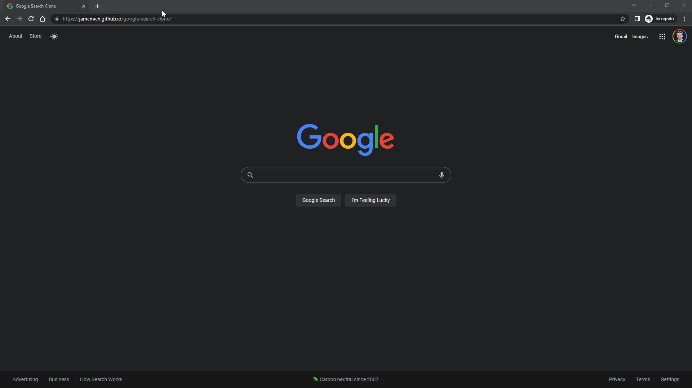

<!-- Heading -->
<section>
    

        
        <h1>Google Search Clone</h1>
        
A static web application that uses Google’s search engine to render results.

    

    

        <a href='#demo'>Demo</a> •
        <a href='#features'>Features</a> •
        <a href='#technologies-used'>Technologies Used</a> •
        <a href='#screenshots'>Screenshots</a> •
        <a href='#problem-solving'>Problem Solving</a> •
        <a href='#code-examples'>Code Examples</a> •
        <a href='#future-improvements'>Future Improvements</a>
    

</section>

<!-- Demo -->

### Demo

[https://jamcmich.github.io/google-search-clone/](https://jamcmich.github.io/google-search-clone/)

<!-- Features -->

### Features

> Note: This website has identical elements and styling to **[Google's search page](https://www.google.com/)** but includes only the essential search features.

*   Search functionality with Google via RapidAPI
*   Responsive styling for mobile, tablet, and desktop

<!-- Technologies -->

### Technologies Used

      

<!-- Screenshots -->

### Screenshots

<!-- Problem Solving -->

### Problem Solving

##### Styling Conventions

This project was my first exposure to using **[WindiCSS](https://windicss.org/guide/)** (an on-demand alternative to **[Tailwind](https://tailwindcss.com/docs/utility-first)**). Although Windi is convenient for styling elements on the fly, it suffers from the same issues as Tailwind: lack of legibility, inability to chain selectors, cluttering the DOM, etc. I realized the need for a consistent naming scheme after styling my first few React components and began researching a flexible solution.

After looking into the issue, I discovered a CSS naming convention created by BEM for writing cleaner and more readable class names. You can read up on the methodology with examples in **[BEM's official guide](http://getbem.com/introduction/)**. These practices provided me with solutions for simplifying the DOM structure, creating descriptive CSS styles, and self-documenting my code.

Reading up on the Windi documentation also provided me with insight for using BEM styling and improving the DOM's readability... (examples).

<!-- Code Examples -->

### Code Examples

<section>
</section>

<!-- Improvements -->

### Future Improvements

-   **[Pagination](https://www.educba.com/pagination-in-javascript/)**
-   "I'm Feeling Lucky" button takes the user to a random page
-   Sorting results into sections (i.e. All, Images, News, etc.)
